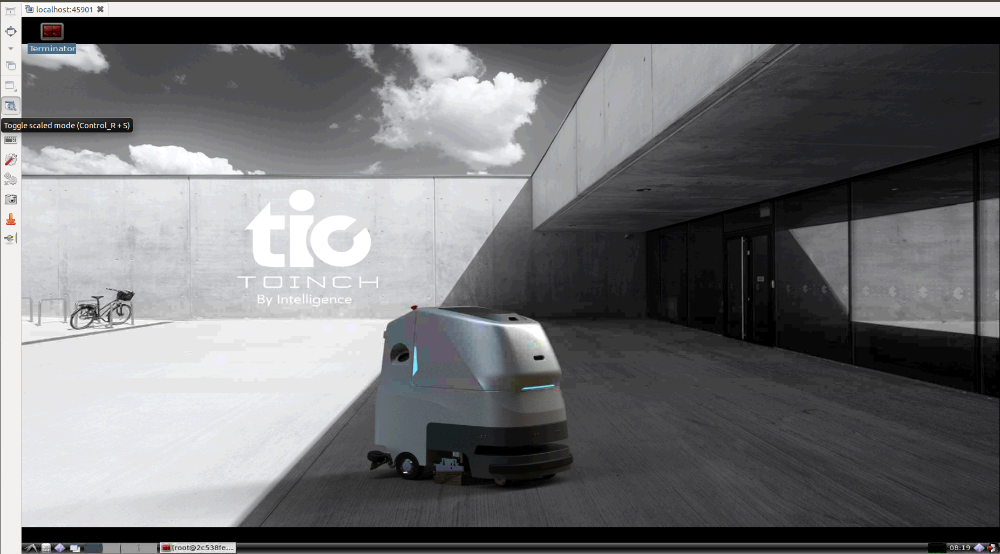
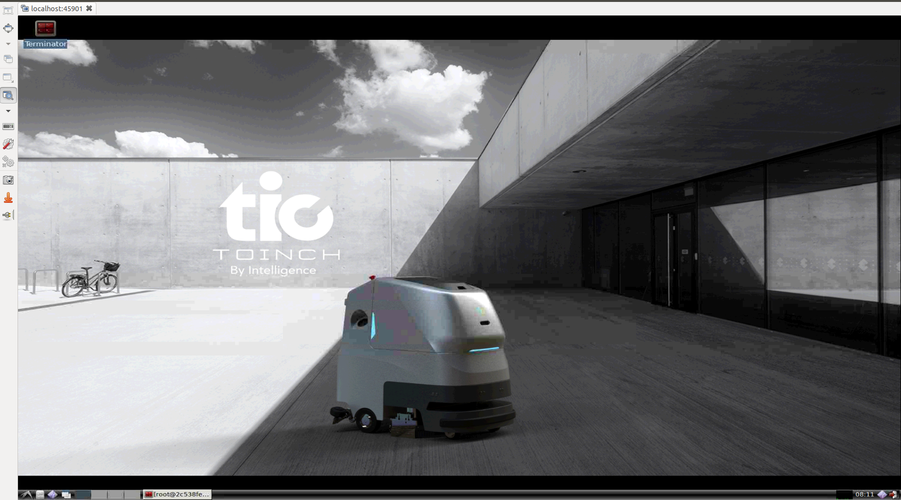

# Docker for 3D Point Cloud Analysis

This is the Docker image for open courseware 3D Point Cloud Analysis from www.shenlanxueyuan.com, China.

All source code are based upon public available resources and starter-code from www.shenlanxueyuan.com.

---

## Environment

The solution has been tested on `Ubuntu 18.04` using `Docker version 19.03.9, build 9d988398e7`

To install Ubuntu on your existing Windows or Mac laptop, you can purchase 

- One additional SSD disk [My Own Choice](https://item.m.jd.com/product/58590009826.html?wxa_abtest=o&utm_user=plusmember&ad_od=share&utm_source=androidapp&utm_medium=appshare&utm_campaign=t_335139774&utm_term=CopyURL)
- One data bus for external disk connection [My Own Choice](https://item.m.jd.com/product/100003150831.html?wxa_abtest=o&utm_user=plusmember&ad_od=share&utm_source=androidapp&utm_medium=appshare&utm_campaign=t_335139774&utm_term=CopyURL)
- Disk holder (Without this when the disk is detached from the bus your machine would die :P) [My Own Choice](https://detail.tmall.com/item.htm?spm=a220m.1000858.1000725.2.2458345cMApFuK&id=607183129563&skuId=4259040688017&user_id=3543159254&cat_id=2&is_b=1&rn=cd2636e1b050f29a4c10f4c9082a33c7)

And

- **Install the Ubuntu on the additional disk**
- When you want to use Ubuntu, **change the boot option to `USB boot` during startup**.

This will keep your native system intact. Personally, **I don't recommend native Ubuntu installation**. If you choose to bootstrap your native Windows/Mac with Ubuntu and your Ubuntu somehow broke your whole system would be **TOTALLY DAMAGED**.

---

## Build Images

### Set Up Docker

#### Add Current User to Docker Group

In order to use docker without `sudo`, current user must be added to Docker group as follows:

```bash
sudo usermod -aG docker $USER
```

#### Enable IPv4 Forwarding

In order to use networking inside Docker, IP forwarding should be enabled. You can check current IP forwarding config using the command below:

```bash
# check ip forwarding, 1 means enabled and 0 means disabled
sudo sysctl net.ipv4.ip_forward
```

To enable IP forwarding **once**, set the flag using the following commands:

```bash
# enable IP forwarding:
sysctl -w net.ipv4.ip_forward=1
# check config status. 1 means it has been successfully enabled.
cat /proc/sys/net/ipv4/ip_forward
```

If you want to enable it **for all**, change the configuration in `/etc/sysctl.conf`:

```bash
##############################################################3
# Functions previously found in netbase
#

# Uncomment the next two lines to enable Spoof protection (reverse-path filter)
# Turn on Source Address Verification in all interfaces to
# prevent some spoofing attacks
#net.ipv4.conf.default.rp_filter=1
#net.ipv4.conf.all.rp_filter=1

# Uncomment the next line to enable TCP/IP SYN cookies
# See http://lwn.net/Articles/277146/
# Note: This may impact IPv6 TCP sessions too
#net.ipv4.tcp_syncookies=1

# Uncomment the next line to enable packet forwarding for IPv4(UNCOMMENT THE LINE BELOW)
net.ipv4.ip_forward=1

# Uncomment the next line to enable packet forwarding for IPv6
#  Enabling this option disables Stateless Address Autoconfiguration
#  based on Router Advertisements for this host
#net.ipv6.conf.all.forwarding=1
```

### Build Environment

The environment can be built with docker-compose as follows:

```bash 
# this will build both cpu and gpu environment
docker-compose build
```

---

## Environment Configuration

### Docker Compose (For CPU Environment ONLY. NVIDIA Docker is NOT Supported Yet)

You can change configuration for cpu environment using `docker-compose` inside [here](docker-compose.yml) (click to follow the link)

#### Volume Mounting

Local directories for source code and data are configured below. This will map your native workspace into into Docker.

```yaml
    volumes:
      # assignments:
      - ${PWD}/workspace/assignments:/workspace/assignments  
      # data volume:
      - ${PWD}/workspace/data:/workspace/data
```

#### Network Port Mapping

Config port mappings for supervisord monitor and VNC client access as follows. This will map internal service ports to your native machine. Make sure the native port is not occupied. 

```yaml
    ports:
      # standard vnc client:
      - 45901:5900
      # supervisord admin:
      - 49001:9001
```

### Docker Run (For GPU Environment)

You can change configuration for gpu environment inside [this launch script](launch-workspace-vnc-gpu.sh) (click to follow the link). Here `docker run` is used because so far `docker-compose` still doesn't support NVIDIA runtime, which is a must for GPU docker instance.

#### Volume Mounting

Local directories for source code and data are configured below. This will map your native workspace into into Docker.

```bash
  -v ${PWD}/workspace/assignments:/workspace/assignments \
  -v ${PWD}/workspace/data:/workspace/data \
```

#### Network Port Mapping

Config port mappings for supervisord monitor and VNC client access as follows. This will map internal service ports to your native machine. Make sure the native port is not occupied. The additional port `6006` is for Tensorboard.

```bash
  -p 49001:9001 \
  -p 45901:5900 \
  -p 46006:6006 \
```

---

## Up and Running 

### Launch VNC Instance
```bash
# for cpu environment, launch with docker-compose:
docker-compose up workspace-vnc-cpu
# for gpu environment, launch with nvidia-docker:
./launch-workspace-vnc-gpu.sh
```

### Health Check

Access supervisord monitor to make sure all processes have been started: http://[HOST_IP]:49001


### VNC Access:

You can access the desktop with standard VNC client

#### VNC Client

On the system you can use 

* Remmina on Ubuntu
* TightVNC Viewer on Windows

to create a VNC session to connect to: http://[HOST_IP]:45901

First, create a new VNC connection as follows. Make sure you have

- Select the correct protocol `VNC`
- Select the correct port on your local machine


When you enter the desktop, click the button to make the window fit to your screen:



Finally,



*BE REVOLUTIONARY!* Keep Learning & Keep Programming! 

Bonne Journée!

---
