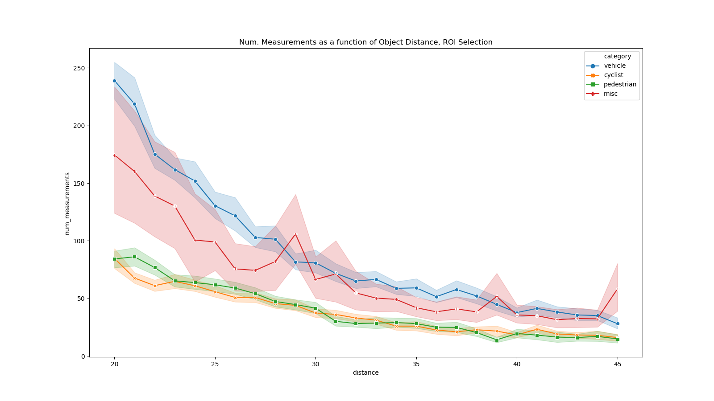

# Detection Pipeline on KITTI 3D Object Dataset

Python object detection pipeline on KITTI 3D Object dataset for Capstone Project One of [3D Point Cloud Processing](https://www.shenlanxueyuan.com/course/204) from [深蓝学院](https://www.shenlanxueyuan.com/)

---

## Solution Guide

---

### Build Object Classification Dataset from KITTI 3D Object

Before deep learning model training, a high quality object classification dataset must be built out of the original KITTI 3D Object dataset. The ETL tool, implemented in Python, is available at (click to follow the link) **[/workspace/assignments/project-01-kitti-detection-pipeline/extract.py](extract.py)**

#### Algorithm Workflow

The algorithm workflow in pseudo code is as follows. For each frame(velodyne-image-calib-label tuple) from KITTI 3D Object:

* First, perform **ground plane & object segmentation** on **Velodyne measurements**.
    * The implementation from [/workspace/assignments/04-model-fitting/clustering.py](assignment 04 of model fitting) is used here for region proposal 
* Build **radius-nearest neighbor** search tree upon segmented objects for later **label association**
* Then load label and associate its info with segmented objects as follows:
    * First, map **object center** from **camera frame** to **velodyne frame** using the parameters from corresponding calib file.
    * Query the search tree and identify a **coarse ROI**. 
        * The radius is determined using the dimensions of the bounding box. Euclidean transform is isometry.
    * Map the point measurements within the sphere into **object frame**.
    * Identify a **refined ROI** through **object bounding box filtering**.
    * Perform **non-maximum suppression on segmented object ids** for final label association:
        * Perform an ID-count on points inside the bounding box.
        * Identify the segmented object with maximum number of measurements inside the bounding box.
        * Associate the KITTI 3D Object label with the segmented object of maximum ID-count.
* Finally, write the **point cloud with normal** and corresponding **metadata** info persistent storage. 

#### Usage

Run the following commands to use the ETL tool:

```bash
# go to workspace:
cd /workspace/assignments/project-01-kitti-detection-pipeline
# activate environment:
conda activate kitti-detection-pipeline
# perform ETL on KITTI 3D Object dataset:
./extract.py -i /workspace/data/kitti-3d-object-detection/training/ -o /workspace/data/kitti_3d_object_classification_normal/
```

#### Visualization of Extracted Dataset

Sample visualization of the extracted classification dataset is as follows:

Camera View                |Lidar Pipeline View
:-------------------------:|:-------------------------:
  |  
  |  
  |  

--- 

### Dataset Analytics before Deep Learning Modelling

Before training the network, data quality check must be performed to minimize the effect of uneven class distribution, etc, on model building.

#### Class Distribution


The above visualization shows that the dataset has a **significantly uneven class distribution**. So measures must be taken to mitigate its effect on network training:

* Perform data augmentation through random rotation along z-axis, etc, to introduct more training instances
* Use focal loss for model optimization

#### Influence of Distance on Measurement Density

For efficient deep-learning network training, all input point clouds should be transformed to the same size. However, the number and density of lidar measurements is influenced by the object's distance to ego vehicle. So measurement count analytics must be performed before choosing FoV and input size.


From the above visualization it's obvious that the number of measurements will drop significantly as the object moves away from ego vehicle. Since for real autonomous driving system only object which lies inside local map matters, here objects which are too far away from ego vehicle will be filtered out from the training set. The threshold can be determined using the local visualization below



---


